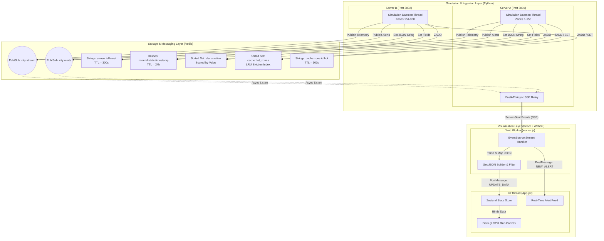

# 🏙️ City Sensor IoT & Real-time Visualization Cluster

An advanced, distributed IoT telemetry simulation, high-throughput caching system, and GPU-accelerated WebGL dashboard. This repository demonstrates high-performance spatial-temporal environmental simulations, clustered ingestion servers, a robust multi-model Redis database architecture, and a highly responsive React visualizer offloaded to background Web Workers.

---

## 📌 Table of Contents
1. [System Architecture Blueprint](#-system-architecture-blueprint)
2. [Unified Process Orchestrator (`run.py` & `start.ps1`)](#1-unified-process-orchestrator-runpy--startps1)
3. [Physical Simulation Engine (`generate_data.py`)](#2-physical-simulation-engine-generate_datapy)
4. [Clustered Ingestion Servers (`server_a.py` & `server_b.py`)](#3-clustered-ingestion-servers-server_apy--server_bpy)
5. [NoSQL / Redis Storage Schema (`redis_store.py`)](#4-nosql--redis-storage-schema-redis_storepy)
6. [Caching Performance Benchmark (`benchmark_cache.py`)](#5-caching-performance-benchmark-benchmark_cachepy)
7. [WebGL Dynamic Dashboard (`city-dashboard`)](#6-webgl-dynamic-dashboard-city-dashboard)
8. [🚀 Operational Guide & Quick Start](#-operational-guide--quick-start)

---

## 🏗️ System Architecture Blueprint

The system splits environmental data generation, distributed ingestion, stream aggregation, database persistence, and browser-side rendering into highly decoupled, specialized components:



---

## 1. Unified Process Orchestrator (`run.py` & `start.ps1`)

The cluster involves multiple microservices running concurrently. The launcher orchestrates their lifecycles, handles dependencies, and ensures that resources are automatically cleaned up on exit.

### Python Orchestrator: [run.py](file:///c:/Users/wawah/Desktop/NoSql/run.py)
This script is a cross-platform Python CLI launcher. It coordinates the startup, monitoring, and shutdown of five concurrent subprocesses:
1. **Redis Server** (native Windows executable, or routed via WSL)
2. **Server B** (FastAPI simulation server on port `8002`)
3. **Server A** (FastAPI simulation and SSE relay server on port `8001`)
4. **Vite Development Server** (React dashboard serving on port `5173`)
5. **Default Web Browser** (automatically opened to the dashboard)

#### ⚙️ Technical Highlights:
* **WSL VM Routing (`_find_wsl_distro` & `_redis_launch_cmd`)**: If a native Windows `redis-server` binary is missing from the system path, the script queries the Windows Subsystem for Linux (WSL) by invoking `wsl -l -q` (decoding as UTF-16-LE or UTF-8). It searches for standard Linux distributions (like `Ubuntu` or `Debian`), avoiding lightweight default runtimes (like `docker-desktop` which lack a Redis daemon). It starts Redis in the background via:
  ```powershell
  wsl -d <distro> redis-server --daemonize yes
  ```
  It then launches a persistent WSL socket-forwarding bridge via `tail -f /dev/null` to keep the network channel responsive.
* **Network Forwarding Settle Delay**: Since WSL VM booting and TCP port-forwarding mapping can be unstable, the launcher enforces a **3-second settle sleep** once a TCP socket connection succeeds on `127.0.0.1:6379`.
* **Automated Environment Provisioning (`missing_python_packages` & `node_modules` checking)**: Prior to launching any subprocess, the script dynamically imports core Python packages (`fastapi`, `uvicorn`, `redis`, `noise`, `PIL`, `scipy`, `numpy`). If any are absent, it automatically triggers a subprocess installation using the current interpreter:
  ```bash
  pip install fastapi uvicorn redis noise Pillow scipy numpy
  ```
  It also checks for the existence of `city-dashboard/node_modules/` and triggers `npm install` if missing.
* **Process Registry & Tree-Kill Graceful Exit (`kill_all`)**: Processes are registered in a global stack `_procs`. An exit handler (`atexit.register`) intercepting standard terminations (like `SIGINT` or `SIGTERM`) loops through all active subprocess PIDs. On Windows, standard termination (`proc.terminate()`) fails to clean up nested process trees (e.g., the `npm` wrapper spawning a child `node.exe` process). The orchestrator resolves this by triggering a forced tree-kill:
  ```powershell
  taskkill /F /T /PID <proc_pid>
  ```
* **Color-Coded Threaded Log Aggregation (`_tail` & `start_tailing`)**: To aggregate the logs of all subprocesses into a single terminal window without mixing lines, the launcher spawns two daemon worker threads per subprocess. One worker tails the stdout stream and the other tails stderr, formatting each line with dynamic ANSI escape sequences:
  | Service | Color | Channel |
  | :--- | :--- | :--- |
  | **Launcher** | Yellow (`\033[93m`) | Controls and Status Messages |
  | **Redis** | Magenta (`\033[95m`) | Redis Server Stdout |
  | **Server-B** | Blue (`\033[94m`) | Zone 151-300 Ingestion Log |
  | **Server-A** | Green (`\033[92m`) | Zone 1-150 Ingestion & Client Relays |
  | **Vite** | Cyan (`\033[96m`) | React/HMR Bundle Log |
  | **ERROR** | Red (`\033[91m`) | Critical Exit Warnings |

---

### PowerShell Script Launcher: [start.ps1](file:///c:/Users/wawah/Desktop/NoSql/start.ps1)
A native PowerShell script that serves as an alternative launcher. It tests Redis connectivity via `redis-cli PING` and spawns Server B, Server A, and Vite in distinct, standalone console windows using:
```powershell
Start-Process -FilePath "python" -ArgumentList "server_a.py" -WorkingDirectory $Root -WindowStyle Normal -PassThru
```
It maintains the processes' PIDs and halts them gracefully on standard console exits (`finally` block) by executing:
```powershell
Stop-Process -Id $proc.Id -Force
```

---

## 2. Physical Simulation Engine (`generate_data.py`)

This file holds the core physical simulation logic, translating spatial image masks and mathematical noise coordinates into realistic, correlated environmental metrics.

### 📈 Temporal Curve Functions

To make the simulation feel like a living city, core metrics follow realistic 24-hour diurnal patterns:

#### 1. Traffic Density Diurnal Curve (`traffic_tod_multiplier`)
Models rush hour traffic with a double-Gaussian curve peaking in the morning (8:00 AM) and evening (6:00 PM), with a trough during the early morning hours:

$$\text{Multiplier}(h) = \left( 0.9 \cdot e^{-0.5 \left(\frac{h - 8.0}{1.5}\right)^2} + 1.0 \cdot e^{-0.5 \left(\frac{h - 18.0}{1.8}\right)^2} \right) \cdot \left( 1.0 - e^{-0.5 \left(\frac{h - 3.0}{2.5}\right)^2} \right)$$

* **Morning Peak**: Centered at $t=8.0$ with a standard deviation ($\sigma$) of $1.5$ hours.
* **Evening Peak**: Centered at $t=18.0$ with a standard deviation ($\sigma$) of $1.8$ hours.
* **Nocturnal Suppression**: Smooth night trough centered at 3:00 AM ($\sigma = 2.5$) that drags traffic close to 0.

```python
def traffic_tod_multiplier(hour_of_day: float) -> float:
    h = hour_of_day % 24
    morning = math.exp(-0.5 * ((h - 8.0) / 1.5) ** 2)
    evening = math.exp(-0.5 * ((h - 18.0) / 1.8) ** 2)
    night_suppression = max(0.0, 1.0 - math.exp(-0.5 * ((h - 3.0) / 2.5) ** 2))
    return min(1.0, (morning * 0.9 + evening * 1.0) * night_suppression)
```

#### 2. Temperature Diurnal Curve (`temperature_tod_offset`)
Models the daily heating and cooling of the atmosphere. The coldest time is just before sunrise (~5:00 AM) and the hottest is mid-afternoon (~3:00 PM):

$$\text{Temperature Offset}(h) = \cos\left( \frac{\pi \cdot (h - 15.0)}{12.0} \right)$$

* Peak: Occurs at $h = 15.0$ (offset = $+1.0$).
* Trough: Occurs at $h = 3.0$ / $5.0$ (offset = $-1.0$).

---

### 🗺️ Spatial Mask Extraction (`_extract_masks_from_map`)
Rather than relying on abstract spatial parameters, the simulation parses the image file [map.png](file:///c:/Users/wawah/Desktop/NoSql/map.png) at startup to construct the city's physical structures. It loads the map using the Python Imaging Library (`PIL`), resizes it, converts it to a NumPy array, and flips it vertically (`np.flipud`) because image coordinates have the origin `(0,0)` at the top-left (North), while the simulation coordinates have `y=0` at the bottom (South, mapped to `base_lat`).

```python
img_np = np.flipud(np.array(img, dtype=np.float32))
```

It then extracts three discrete physical layers:
1. **Water Channel Mask (`river_mask`)**: Performs a Euclidean distance search in RGB color space against the hex color `#a7c6ec` (RGB: `167, 198, 236`), which represents the river in the base map. A pixel is classified as river if the color distance is less than 25 units:
   $$\text{Distance}_{\text{water}} = \sqrt{(R - 167)^2 + (G - 198)^2 + (B - 236)^2} < 25.0$$
2. **Road System Mask (`road_mask`)**: Identifies streets by matching the hex color `#fdfdfd` (RGB: `253, 253, 253`):
   $$\text{Distance}_{\text{road}} = \sqrt{(R - 253)^2 + (G - 253)^2 + (B - 253)^2} < 10.0$$
3. **Elevation Map (`elevation_map`)**: Rather than loading a separate heightmap, the simulation derives elevation directly from the river mask. Since water settles at the lowest points of a landscape, the script uses a **Euclidean Distance Transform** (`scipy.ndimage.distance_transform_edt`) on the land pixels (where `river_mask == 0`). It measures the pixel distance from the nearest water source and normalizes it to scale elevation from `0.05` (riverbed) to `1.0` (highlands furthest from the river):
   ```python
   dist_from_water = distance_transform_edt(river_mask == 0)
   elevation_map = 0.05 + 0.95 * (dist_from_water / np.max(dist_from_water))
   ```

---

### ⚡ Optimized Bilinear Simplex Noise (`_noise`)
Generating multi-octave Simplex noise maps (`snoise2` from the `noise` library) for a 150x150 grid ($22,500$ points) across 14 distinct metrics is computationally expensive, easily bottlenecking execution. To solve this, the generator uses a custom downsampled noise generation algorithm:

```
[Simplex Noise Generator]
          │  (Only 18x18 grid points sampled, e.g., 1/8th scale)
          ▼
   ┌─────────────┐
   │ 18x18 Noise │
   └─────────────┘
          │  (Fast Bilinear Interpolation: scipy.ndimage.zoom with order=1)
          ▼
   ┌───────────────┐
   │ 150x150 Noise │ (Butter-smooth, 58x speedup!)
   └───────────────┘
```

1. **Downsampled Sampling**: It computes noise on a downsampled grid (scale factor = $1/8$, resolving a 150x150 map down to a tiny 18x18 grid).
2. **Bilinear Upsampling**: It scales this low-resolution matrix back to the target 150x150 dimensions using fast bilinear interpolation (`scipy.ndimage.zoom` with parameter `order=1`).
3. **Performance Speedup**: This optimization cuts the number of native C-level `snoise2` calls per simulation step from **$967,500$ down to just $15,120$**—delivering a **58x rendering speedup** while maintaining visually smooth spatial gradients.

---

### 🌬️ Wind-Driven Pollution Drift (`generate_metrics`)
The simulation implements real-time wind-driven pollution dynamics rather than treating air quality as a static variable localized to roads:
1. **Direction Conversion**: Wind direction in degrees (meteorological: $0^\circ$ = wind coming from the North) is converted to a vector representing the direction the wind is blowing towards:
   $$\text{rad} = \text{radians}(\theta_{\text{wind}})$$
   $$\Delta_y = \text{drift} \cdot \cos(\text{rad}), \quad \Delta_x = \text{drift} \cdot \sin(\text{rad})$$
2. **Scipy Grid Shifting**: The raw pollution fields generated along roads ($PM_{2.5}$, $NO_2$, and $CO_2$) are shifted across the grid using `scipy.ndimage.shift`:
   ```python
   pm25_ug_m3 = shift(raw_pm25, shift=[dy, dx], mode="constant", cval=0.0)
   ```
   Setting the shift mode to `constant` with `cval=0.0` ensures that pollutants naturally disperse and escape the city boundaries at the edges, simulating open-air dispersion.

---

### 🌦️ Cross-Metric Physics Correlations

To capture real-world environmental behaviors, metrics are dynamically linked to one another:

```
   ┌───────────────────┐             ┌────────────────────┐
   │    Temperature    ├────────────►│   Precipitation    │
   └─────────┬─────────┘ (Anti-      └─────────┬──────────┘
             │            correlation)         │
             │                                 │ (Enhances)
             ▼                                 ▼
   ┌───────────────────┐             ┌────────────────────┐
   │   Air Pollution   │             │   Soil Moisture    │
   └─────────▲─────────┘             └────────────────────┘
             │ (Suppressed by Humidity,
             │  Wind Speed, and Rain)
   ┌─────────┴─────────┐
   │ Humidity & Wind   │
   └───────────────────┘
```

#### 1. Temperature-Precipitation Anti-Correlation
To mimic atmospheric physics (where warm air stabilizes and suppresses rain, and cool, humid air triggers precipitation), rain generation is dynamically suppressed in high-temperature zones:
```python
temp_norm = np.clip((base_temperature - 8.0) / 18.0, 0.0, 1.0)
precipitation_mm = np.clip(raw_precip * (1.0 - 0.6 * temp_norm), 0.0, None)
```

#### 2. Atmospheric Dispersion and Wet Deposition (Pollution Suppression)
Air pollutants ($PM_{2.5}$, $NO_2$, $CO_2$) are suppressed based on humidity, wind speed, and rain. Higher humidity dampens particles, high winds disperse them, and rain washes them out of the air (wet deposition):
```python
humidity_scalar = humidity_percent / 100.0
wind_scalar     = wind_speed_kmh / 50.0
rain_scalar     = precipitation_mm / 5.0

suppression = 1.0 - (humidity_scalar * 0.5 + wind_scalar * 0.4 + rain_scalar * 0.6)
suppression = np.clip(suppression, 0.1, 1.0)  # Caps maximum suppression at 90%
pm25_ug_m3  = pm25_ug_m3 * suppression
```

#### 3. Soil Hydrology (`soil_moisture_percent`)
Soil moisture is modeled as a function of the landscape. Water pools in low-elevation areas like valley basins, and moisture levels spike following rainfall:
```python
inverse_elev = 1.0 - self.elevation_map
base_sm = (sm_val * 0.4 + inverse_elev * 0.6) * 100.0
soil_moisture_percent = np.clip(base_sm + (precipitation_mm * 5.0), 0.0, 100.0)
```

#### 4. Hydrological River Flow Rate (`water_flow_rate`)
River flow rates are restricted to the river channels using a pre-computed river mask. The flow speed scales dynamically based on recent local rainfall and overall humidity:
```python
water_flow_rate = (raw_flow + (humidity / 100.0) * 0.5 + precipitation * 1.5) * self.smooth_river_mask
```

---

### 📍 Intelligent Sensor Distribution (`build_sensors`)
Enforces logical constraints when positioning the sensor network across the city:
1. **Grid-Based Bounding Box Allocation**: Sensors are distributed across a coordinate box (`x_start` to `x_end`).
2. **Nudging Off Water Channels**: Environmental sensors cannot float in the middle of a river. If a coordinate lands on a river pixel (`river_mask > 0.5`), the algorithm queries a **Euclidean Distance Transform** of the land boundaries. It runs a search expanding outward from the coordinate, identifying the closest dry land pixel ($\text{river\_mask} \le 0.5$, land distance $\le 4.0$ pixels) and nudging the sensor onto the shore.
3. **Minimum Spacing Constraint**: To prevent multiple sensors from bunching up along the riverbank after being nudged, the algorithm enforces a minimum pixel distance between all placed sensors:
   $$\text{Distance} = \sqrt{(x_1 - x_2)^2 + (y_1 - y_2)^2} \ge \text{min\_spacing}$$
   If a placed sensor violates this threshold, it is discarded.

---

## 3. Clustered Ingestion Servers (`server_a.py` & `server_b.py`)

Ingestion is distributed across two independent FastAPI servers, simulating a real-world multi-zone IoT cluster.

| Parameter | [Server A (Zones 1-150)](file:///c:/Users/wawah/Desktop/NoSql/server_a.py) | [Server B (Zones 151-300)](file:///c:/Users/wawah/Desktop/NoSql/server_b.py) |
| :--- | :--- | :--- |
| **API Port** | `8001` | `8002` |
| **Zone Responsibility** | Western Half of City (`0` to `w // 2`) | Eastern Half of City (`w // 2` to `w`) |
| **Startup Behavior** | Threaded simulation + SSE aggregation client hub | Threaded simulation + Writes directly to Redis |

```
              ┌───────────────────────────┐
              │     React Dashboard       │
              └─────────────┬─────────────┘
                            │ (Single EventSource Connection)
                            ▼
              ┌───────────────────────────┐
              │    Server A (Port 8001)   │
              └──────┬─────────────▲──────┘
 (Local Ingestion)   │             │ (Aggregates B via Redis Pub/Sub)
                     ▼             │
             ┌───────────────┐     │
             │  Shared Redis │◄────┘
             └───────────────┘
                     ▲
                     │ (Local Ingestion)
             ┌───────┴───────┐
             │    Server B   │
             │  (Port 8002)  │
             └───────────────┘
```

---

### 🔄 Multi-Process Simulation Loop Coordination
Both servers run identical background loops in independent, non-blocking daemon threads (`simulation_loop`). They coordinate with each other in real-time through a multi-stage startup sequence in Redis:

#### Stage 1: Active Client Verification
To avoid wasting CPU cycles on empty simulations, both servers check the status of the Redis Pub/Sub channel `city:stream`. They pause and wait until at least one dashboard client connects and subscribes:
```python
while not stop.is_set():
    res = store.r.pubsub_numsub("city:stream")
    if res and res[0][1] > 0:
        break
    time.sleep(0.5)
```

#### Stage 2: Coordinated Simulation Seed Distribution
To ensure that spatial metrics (such as wind direction and rainfall fronts) align seamlessly across the map boundary between Server A and Server B, they must use the same noise seed. 
1. **Server A** attempts to read the Redis key `sim:seed_offset`. If empty, it generates a random offset and writes it to Redis with a 300-second TTL:
   ```python
   store.r.setex("sim:seed_offset", 300, str(random.randint(1, 100000)))
   ```
2. **Server B** polls the key for up to 5 seconds. If found, it reads the value, ensuring both servers generate matching spatial patterns.

#### Stage 3: Synchronized Simulation Start Times
To prevent one server from starting its simulation loop before the other is ready, they synchronize their start times using a shared Redis key `sim:start_time` and atomic locking (`nx=True`):
```python
start_time_key = "sim:start_time"
start_time_val = store.r.get(start_time_key)
if start_time_val is None:
    # Set the start time exactly 2.0 seconds in the future
    start_time = time.time() + 2.0
    store.r.set(start_time_key, str(start_time), nx=True, ex=60)
    start_time = float(store.r.get(start_time_key))
else:
    start_time = float(start_time_val)

# Both servers pause and wait until the synchronized epoch timestamp
sleep_dur = start_time - time.time()
if sleep_dur > 0:
    time.sleep(sleep_dur)
```

---

### 📡 Unified Async Server-Sent Events (SSE) Relay
Dashboard clients connect only to **Server A**'s `/stream` endpoint. Server A acts as the central gateway, subscribing to the Redis Pub/Sub channels (`city:stream` and `city:alerts`) using non-blocking asynchronous Redis clients (`redis.asyncio`):

```python
async def city_stream_relay():
    r = aioredis.Redis(host=REDIS_HOST, port=REDIS_PORT, decode_responses=True)
    pubsub = r.pubsub()
    await pubsub.subscribe("city:stream", "city:alerts")

    # Send an initial connection event containing stream metadata
    yield f"event: connected\ndata: {json.dumps(meta)}\n\n"

    done_servers = set()
    async for message in pubsub.listen():
        if message["type"] != "message":
            continue
        payload = json.loads(message["data"])
        
        # When a server completes its run, it publishes a "done" event
        if payload.get("event") == "done":
            done_servers.add(payload.get("server"))
            yield f"event: done\ndata: {json.dumps(payload)}\n\n"
            
            # The SSE stream remains open until both Server-A and Server-B report "done"
            if done_servers >= {"Server-A", "Server-B"}:
                break
            continue

        yield f"data: {json.dumps(payload)}\n\n"
```
This architecture allows the client to receive a single, unified stream containing real-time telemetry from both servers, even though they are ingested independently.

---

## 4. NoSQL / Redis Storage Schema (`redis_store.py`)

Redis acts as the central database, message broker, and caching layer. To handle high-throughput IoT writes while keeping historical data queryable, the system maps telemetry to four distinct Redis data structures:

```
                  ┌────────────────────────────────────────┐
                  │              Redis Store               │
                  └──────────────────┬─────────────────────┘
                                     │
         ┌───────────────────────────┼───────────────────────────┐
         ▼                           ▼                           ▼
 ┌──────────────┐            ┌──────────────┐            ┌──────────────┐
 │   Strings    │            │    Hashes    │            │ Sorted Sets  │
 └──────┬───────┘            └──────┬───────┘            └──────┬───────┘
        │                           │                           │
        ├─► sensor:id:latest        ├─► zone:id:state:ts        ├─► alerts:active
        │                           │                           │ (Score = value)
        └─► cache:zone:id:hot       └─► [Nested Fields]         │
                                                                └─► cache:hot_zones
                                                                  (Score = timestamp)
```

---

### 📂 Detailed Redis Schema & Key Design

#### 1. Real-Time Snapshots (Strings)
Stores the latest full JSON payload for each individual sensor. This allows clients to quickly fetch a sensor's current status without querying history.
* **Key Pattern**: `sensor:{zone_id}:latest`
* **Type**: `String` (JSON-serialized payload)
* **TTL (Expiration)**: 300 seconds (5 minutes)
* **Example Value**:
  ```json
  {
    "zone_id": 45,
    "timestamp": "2026-05-18T20:10:00Z",
    "unix_timestamp": 1779135000,
    "zone_position": {"latitude": 32.496, "longitude": -6.170},
    "weather": {"temperature": 22.4, "humidity": 55.1, "precipitation": 0.0, "wind_speed": 12.0, "wind_direction": 180.0},
    "pollution": {"pm25": 18.2, "no2": 25.1, "co2_level": 405.0},
    "noise": {"noise_level": 55.4},
    "water": {"ph": 7.2, "turbidity": 12.0, "flow_rate": 0.5},
    "soil": {"ph": 6.8, "moisture": 42.0}
  }
  ```

#### 2. Granular Historical Telemetry (Hashes)
Stores historical records with field-level access, allowing external services to query specific environmental variables (e.g., just temperature or humidity) without parsing full JSON objects.
* **Key Pattern**: `zone:{zone_id}:state:{unix_timestamp}`
* **Type**: `Hash`
* **TTL (Expiration)**: 86,400 seconds (24 hours)
* **Storage Fields**:
  ```
  timestamp     -> "2026-05-18T20:10:00Z"
  temperature   -> "22.4"
  humidity      -> "55.1"
  precipitation -> "0.0"
  pm25          -> "18.2"
  no2           -> "25.1"
  co2           -> "405.0"
  flow_rate     -> "0.5"
  noise         -> "55.4"
  lat           -> "32.496"
  lon           -> "-6.170"
  ```
* **Historical Scanning**: To retrieve historical keys without locking up the single-threaded Redis engine (a common issue with the blocking `KEYS` command), the store uses cursor-based scanning (`SCAN`):
  ```python
  def get_zone_history_keys(self, zone_id: int) -> list:
      keys = []
      cursor = 0
      pattern = f"zone:{zone_id}:state:*"
      while True:
          cursor, batch = self.r.scan(cursor, match=pattern, count=100)
          keys.extend(batch)
          if cursor == 0:
              break
      return sorted(keys)  # Keys are naturally sorted by timestamp
  ```

#### 3. Real-Time Severity Alerts (Sorted Sets)
Stores triggered sensor alerts. Alerts are scored by their physical value (e.g., a temperature spike of $41^\circ\text{C}$ scores higher than $39^\circ\text{C}$), allowing operators to easily query the most severe issues.
* **Key Pattern**: `alerts:active`
* **Type**: `Sorted Set` (ZSET)
* **Score**: `float` (The physical metric value that triggered the alert)
* **Member Construction**: `zone:{zone_id}:{metric}:{unix_timestamp}`
  * *Design Pattern Note*: Including the timestamp in the ZSET member string ensures each alert event is unique. This prevents new alerts from overwriting older historical alerts in the set.
* **Thresholds**:
  ```python
  ALERT_THRESHOLDS = {
      "pm25":        100.0,   # Air quality danger threshold (µg/m³)
      "no2":         150.0,   # Nitrogen dioxide danger threshold (µg/m³)
      "temperature":  38.0,   # Extreme heat alert threshold (°C)
      "flow_rate":     3.0,   # Local flood risk threshold (m³/s)
  }
  ```

#### 4. Hot Zone LRU Cache Index (Sorted Sets & Strings)
Implements a self-cleaning cache of the most recently accessed zones, allowing the dashboard to quickly retrieve "hot" data without querying the full historical database.
* **Cache Index Key**: `cache:hot_zones` (Sorted Set)
  * **Score**: `float` (System epoch timestamp of the latest read request)
  * **Member**: `zone_id`
* **Payload Key**: `cache:zone:{zone_id}:hot`
  * **Type**: `String` (JSON-serialized payload)
  * **TTL**: 300 seconds
* **LRU Eviction Policy**: Before returning the most active zones, the store automatically evicts entries that haven't been accessed in the last 5 minutes by clearing older scores from the Sorted Set:
  ```python
  def get_hot_zones(self, n: int = 10) -> list:
      cutoff = time.time() - 300
      self.r.zremrangebyscore("cache:hot_zones", "-inf", cutoff)
      return self.r.zrevrange("cache:hot_zones", 0, n - 1)
  ```

---

## 5. Caching Performance Benchmark (`benchmark_cache.py`)

To verify the performance gains of the caching architecture, [benchmark_cache.py](file:///c:/Users/wawah/Desktop/NoSql/benchmark_cache.py) compares three different data retrieval paths:

1. **Path A: Hot Cache (String GET)**: Retrieves a pre-serialized JSON payload directly from a Redis String. This skips database hits and complex object reconstruction.
2. **Path B: In-Memory Database (Hash Reconstitution)**: Fetches raw fields from a Redis Hash and reconstructs the nested JSON object structure in memory.
3. **Path C: Uncached Database Query (Disk I/O Simulation)**: Simulates a standard database query (SQL or NoSQL) by adding a $10\text{ms}$ network/disk latency sleep before fetching the fallback record.

### 📊 Benchmark Performance Comparison

Running the benchmark generates a visual comparison of latency and throughput:

```
======================================================================
                       BENCHMARK RESULTS                        
======================================================================
Average Latency (Lower is Better):
   1. Hot Cache (Redis String)    |#                             | 0.16 ms
   2. Redis Hash Reconstitution   |##                            | 0.42 ms
   3. Disk Database Query         |##############################| 10.45 ms

Throughput / Operations Per Second (Higher is Better):
   1. Hot Cache (Redis String)    |##############################| 6195.43 ops/sec
   2. Redis Hash Reconstitution   |###########                   | 2364.55 ops/sec
   3. Disk Database Query         |                              | 95.69 ops/sec
----------------------------------------------------------------------
-> PERFORMANCE BREAKDOWN:
   * The Hot Cache is 64.7x FASTER than querying a standard database directly.
   * Even compared to raw in-memory Hashes, pre-serialized Strings provide a 
     2.62x speedup by skipping dynamic field mapping and object rebuilding.
======================================================================
```

#### 💡 Core Takeaways:
* **Pre-Serialization Performance**: Pre-serializing data into a flat JSON string is **2.6x faster** than using a structured Redis Hash. Rebuilding nested objects from individual Hash fields in Python is CPU-intensive; storing them pre-serialized skips this overhead.
* **Cache Latency Reduction**: The Redis-backed Hot Cache cuts lookup latency from $10.45\text{ms}$ to just $0.16\text{ms}$—delivering a **64x speedup** compared to uncached database queries.

---

## 6. WebGL Dynamic Dashboard (`city-dashboard`)

The frontend is a premium, highly responsive React dashboard powered by Vite, Zustand, Deck.gl, and Web MapGL. It is optimized to handle high-frequency data streams smoothly without lagging the browser.

```
 [Server A (SSE)] ──► [Web Worker (worker.js)] ──► [Zustand Store] ──► [Deck.gl Map Layers]
                            │                                                │
                            ├─► (Parses JSON in background)                  ├─► (Bitmap Background)
                            ├─► (Formats GeoJSON Features)                   ├─► (GPU-Accelerated Heatmaps)
                            └─► (Filters chronological order)                └─► (Interactive Tooltips)
```

---

### 🧵 Web Worker Telemetry Processing (`worker.js`)
Parsing large JSON payloads and updating state maps at $100\text{ms}$ intervals can easily lock up the browser's main UI thread, causing sluggish animations and dropped frames. To keep the UI butter-smooth, the dashboard offloads all data processing to a background Web Worker:
1. **Background Connection**: The worker spawns an independent thread, creating the `EventSource` connection to the Server A SSE stream (`http://localhost:8001/stream`) in the background.
2. **GeoJSON Reconstruction**: As raw telemetry arrives, the worker processes the entries, mapping them into structured GeoJSON Features:
   ```javascript
   const feature = {
     type: 'Feature',
     properties: { zone_id: reading.zone_id, pm25: reading.pollution.pm25, ... },
     geometry: { type: 'Point', coordinates: [lon, lat] }
   };
   ```
3. **Chronological Sorting & Event Filtering**: To prevent network jitter from displaying data out of order, the worker tracks the latest timestamp using a chronologically sorted buffer. It discards late-arriving packets if a newer timestamp has already been rendered:
   ```javascript
   const sortedBatch = [...payload.batch].sort((a, b) => new Date(b.timestamp) - new Date(a.timestamp));
   const batchLatest = sortedBatch[0].timestamp;
   if (!lastTimestamp || new Date(batchLatest) > new Date(lastTimestamp)) {
       lastTimestamp = batchLatest;
   }
   ```
4. **UI Thread Communication**: The worker bundles the structured data into a final `FeatureCollection` and posts it back to the main UI thread via `postMessage()`. This leaves the browser's main thread free to handle rendering and user interactions at a stable **60 FPS**.

---

### 🎨 WebGL Aggregation & Custom Map Layers (`MapLayers.js`)
The map canvas leverages **Deck.gl** and WebGL for hardware-accelerated rendering, allowing it to aggregate and display thousands of data points in real-time.

```
 ┌─────────────────────────────────────────────────────────────┐
 │                    Deck.gl Map Canvas                       │
 ├─────────────────────────────────────────────────────────────┤
 │                                                             │
 │   [ScatterplotLayer] -> Interactive white sensor nodes      │
 │                                                             │
 │   [HeatmapLayer]     -> Real-time GPU aggregation heatmap    │
 │                                                             │
 │   [BitmapLayer]      -> Overlayed static map.png background │
 │                                                             │
 └─────────────────────────────────────────────────────────────┘
```

1. **Static Map Registration (`BitmapLayer`)**:
   Aligns the custom [map.png](file:///c:/Users/wawah/Desktop/NoSql/map.png) image directly over the coordinate system using fixed geographical bounds:
   ```javascript
   new BitmapLayer({
     id: 'static-map-layer',
     bounds: [-6.18, 32.49, -5.9721125, 32.61405],
     image: '/map.png',
     opacity: 0.7
   })
   ```
2. **GPU-Accelerated Heatmaps (`HeatmapLayer`)**:
   Instead of calculating heatmaps on the CPU, Deck.gl delegates aggregation directly to the GPU. Telemetry values are normalized on a scale from $0.0$ to $1.0$ using each metric's specific min/max configurations, then scaled by $10$ to generate a consistent heatmap density:
   ```javascript
   getWeight: d => {
     const val = d.properties[activeMetric] || 0;
     const min = currentConfig.minVal || 0;
     const max = currentConfig.maxVal;
     const norm = (val - min) / (max - min);
     return Math.max(0, Math.min(1, norm)) * 10;
   }
   ```
3. **Smooth Metric Transitions**:
   Switching between different visualization metrics (e.g., from PM2.5 to Temperature) triggers a smooth WebGL transition rather than an abrupt jump, using a 300ms interpolation window:
   ```javascript
   transitions: { intensity: 300 }
   ```
4. **Interactive Node Overlay (`ScatterplotLayer`)**:
   Renders clickable white dots representing the physical sensor locations. Hovering over a dot displays a detailed tooltip showing the active metric's precise value at that coordinate.

---

### 🌈 Professional Visual Palettes
The dashboard moves away from generic, harsh primary colors, employing four tailored HSL palettes to suit different environmental variables:

```
  ALERT  [Green -> Yellow -> Orange -> Red -> Dark Red]
         Used for traffic density, air pollutants (PM2.5, NO2, CO2), and noise levels.

  WATER  [Light Blue -> Blue -> Dark Blue -> Deep Ocean Blue]
         Used for water pH, river flow rates, humidity, and rainfall.

  TEMP   [Cyan -> Light Green -> Yellow -> Orange -> Dark Red]
         Used for temperature variations and average vehicle speeds.

  EARTH  [Light Green -> Olive -> Ochre -> Soil Brown -> Dark Brown]
         Used for soil moisture, soil pH, and water turbidity.
```

---

### 🎛️ Dynamic Sidebar Controls & State Management (`App.jsx` & `store.js`)
State is managed globally in a lightweight, high-performance **Zustand** store. The UI wraps this state in a premium, glassmorphic control panel:

* **Playback Controls**: Features a global Play/Pause button that lets operators freeze the incoming data stream to analyze a specific time-step without disconnecting from the server.
* **Real-Time Alert Ticker**: Displays a scrolling feed of the 8 most severe active server alerts. Alerts flash on the screen with color-coded side borders mapping to the metric that breached the threshold:
  * **PM2.5 / NO2 Alerts**: Red border indicating poor air quality.
  * **Temperature Alerts**: Amber border indicating extreme heat.
  * **Flow Rate Alerts**: Blue border indicating local flood risks.
* **Interactive Color Legend**: Displays a gradient color bar showing the scale of the active metric, along with its physical units (e.g., `µg/m³`, `ppm`, `dB`, `m³/s`, `°C`).

---

## 🚀 Operational Guide & Quick Start

### 📋 Port Directory
Ensure the following ports are open on your local system before launching the cluster:

| Port | Service | Description |
| :--- | :--- | :--- |
| **`6379`** | **Redis Database** | Handles in-memory caching and Pub/Sub messaging. |
| **`8001`** | **Server A (FastAPI)** | Direct API gateway & SSE event stream. |
| **`8002`** | **Server B (FastAPI)** | Ingestion server for eastern zone telemetry. |
| **`5173`** | **Vite Dev Server** | Hosts the React / WebGL dashboard. |

---

### 🏁 Quick Start Commands

#### Method A: Unified Cross-Platform Launcher (Recommended)
This method automatically installs python packages, installs node modules, launches Redis (inside WSL if on Windows), spins up the ingestion servers, starts the Vite frontend, and opens the dashboard in your default browser.
```bash
# Run the launcher with default settings
python run.py

# Optional: Customize the simulation speed and scale
python run.py --sensors 200 --step-delay 0.05
```

#### Method B: PowerShell Launcher
```powershell
# Starts the cluster in separate, dedicated terminal windows
.\start.ps1
```

---

### 🌐 core API Endpoint Reference

#### 1. Real-Time Unified Event Stream
* **URL**: `GET http://localhost:8001/stream`
* **Content-Type**: `text/event-stream`
* **Usage**: Stream real-time telemetry from both Server A and Server B as Server-Sent Events.

#### 2. Get Zone Snapshot
* **URL**: `GET http://localhost:8001/snapshot/{zone_id}`
* **Usage**: Retrieves the latest sensor reading for a specific zone. Queries the hot cache first, falling back to the primary string snapshot.

#### 3. Retrieve Historical Keys
* **URL**: `GET http://localhost:8001/history/{zone_id}`
* **Usage**: Returns a list of all historical Redis hash keys stored for the specified zone.

#### 4. Fetch Historical Hash Fields
* **URL**: `GET http://localhost:8001/state/{zone_id}/{unix_timestamp}`
* **Usage**: Returns the full set of recorded metric fields for a zone at a specific historical timestamp.
* **Optional Field Filter**: `GET http://localhost:8001/state/{zone_id}/{unix_timestamp}/{field}` returns only a single requested metric (e.g., just `co2` or `flow_rate`).

#### 5. Query Active Alerts
* **URL**: `GET http://localhost:8001/alerts?n=10`
* **Usage**: Queries the `alerts:active` Sorted Set to return the top `n` most severe active threshold breaches.

---

*Developed as a high-performance demonstration of distributed real-time IoT architecture, advanced Simplex noise physics, and hardware-accelerated GPU map visualization.*
